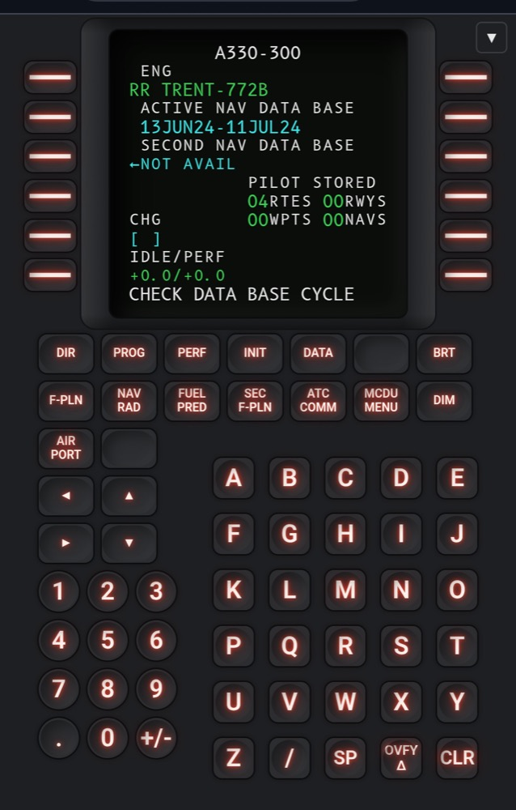

# xplane-mcdu-a333

A web-based MCDU (CDU) for X-Plane 12's stock Airbus A330. It runs as a page
in any browser and talks to X-Plane over the sim's built-in Web API — no
X-Plane plugin to install. A small local server needs to run alongside
X-Plane (plain Node.js, no dependencies — see "Getting started" below), but
that's it. Open the page on a tablet on the same network as the sim and you
have a second CDU next to your keyboard.

**Scope:** verified against the default/stock A330 only. Add-on airliners
(Zibo 737, FlightFactor, ToLiss, ...) use their own dataref/command
namespaces and need a separate profile — see "Adding support for another
aircraft" below. The app itself isn't A330-specific under the hood: it reads
its dataref/command mapping from `config/profiles/*.json` and currently
ships one verified profile.

## Screenshots

<table>
<tr>
<td align="center" width="33%"><br>Desktop</td>
<td align="center" width="33%"><br>Phone</td>
<td align="center" width="33%"><br>Tablet</td>
</tr>
</table>

## Requirements

- X-Plane 12.1.4 or later — this is when the Web API added command support,
  which keypresses need (dataref access alone works from 12.1.1).
- In X-Plane's **Settings → Network**: the Web API on (default since 12.1.2)
  and **Allow incoming connections** on. The latter is needed even for
  connections from the same machine — see `docs/xplane-web-api-notes.md`
  for what's confirmed about why.
- Node.js 22.4 or later, installed on the same machine as X-Plane.
- A tablet (or any other device) on the same network, if you want to use
  this away from the X-Plane machine.

## Getting started

```sh
git clone https://github.com/larsten42/xplane-mcdu-a333.git
cd xplane-mcdu-a333
node tools/mcdu-server.js
```

Open the printed URL — `http://localhost:5173` on the X-Plane machine, or
`http://<that machine's LAN IP>:5173` from a tablet — and press **Connect**.
There's no host or port to configure; the page always talks back to
whatever server it loaded from.

No `npm install` is needed to run the app itself — see "How it works" below.

### Trying it without X-Plane running

```sh
npm install && npm run mock   # starts a mock X-Plane Web API on :8086
node tools/mcdu-server.js      # in another terminal
```

This starts a small stand-in server that mimics enough of the Web API to
click through the interface, useful for confirming everything's wired up
before pointing it at a real sim. You should see "MCDU MOCK SERVER" on line
1 and be able to type on the scratchpad line using the on-screen keypad.

## How it works

```
   tablet browser                 tools/mcdu-server.js              X-Plane 12
┌───────────────────────┐  ws/http  ┌──────────────────────┐  ws/http  ┌──────────────────┐
│ index.html + src/*.js  │◄─────────►│  static files +      │◄─────────►│ built-in Web API │
│  - xplane-client.js    │ port 5173 │  /api/* proxy        │ localhost │  (REST + WS)     │
│  - mcdu-adapter.js     │           │  (REST + WS relay)   │  :8086    └──────────────────┘
│  - mcdu-screen.js      │           └──────────────────────┘
│  - mcdu-keypad.js      │
└───────────────────────┘
```

`tools/mcdu-server.js` runs once, on the same machine as X-Plane, and does
two things: serves the app's static files, and forwards everything under
`/api/` (REST and WebSocket) to X-Plane over `localhost`. The browser only
ever talks to whatever host and port served it the page — it never needs
X-Plane's address directly, which is what lets a tablet connect without any
setup beyond opening a URL.

For the full protocol reference — endpoints, message formats, the CDU
dataref layout, and some rough edges we ran into along the way — see
`docs/xplane-web-api-notes.md`.

## Building a distributable copy

```sh
npm run build:release
```

Copies the files needed to run the app (not the dev tools or docs) into
`dist/`. Zip that folder to share a self-contained copy — the only
requirement on the other end is Node.js.

If X-Plane runs on a different machine than `mcdu-server.js`, set the
`XPLANE_HOST`/`XPLANE_PORT` environment variables before starting it. That
machine will also need **Allow incoming connections** on and its Web API
port reachable from the `mcdu-server.js` machine.

To check connectivity directly, or see exactly what's on the CDU screen
right now:

```sh
node tools/smoke-test.mjs                     # localhost:8086 by default
node tools/smoke-test.mjs 192.168.1.50 8086   # or a specific host
```

## Known limitations

- Only the stock/default X-Plane FMS is supported today. Add-on airliners
  need their own profile (see below); buttons whose command doesn't
  resolve are disabled rather than silently failing, so a missing profile
  is obvious rather than confusing.
- Brightness and annunciator-light datarefs were found alongside the
  keypad mapping but aren't wired into the interface yet.
- No automatic reconnect, no multi-tablet coordination beyond X-Plane's
  own CDU1/2/3 split, no offline/PWA support yet.
- Rendering assumes one style byte per character, which holds for plain
  ASCII; multi-byte glyphs like ° could in principle misalign (not
  observed in practice).

## Interface

- **Keypad**: laid out and sized to match the real bezel, not a generic
  grid.
- **Key style**: a selector switches between Flat, Bevel, and Deboss
  looks — cosmetic only, persists across reloads.
- **Full screen**: the button in the top-right hides the connection
  controls, for flying without clutter on screen.
- **Keyboard input**: once connected, your physical keyboard drives the
  alpha/numeric keys, plus `.`, `/`, `-`, and Backspace (→ CLR).

## Adding support for another aircraft

A profile (`config/profiles/*.json`) has four parts:

- `screen` — line/column count and the dataref name template for the text
  and style arrays.
- `commandPrefixByCdu` — the command namespace prefix for each CDU
  position, composed with each key's `command` suffix.
- `keys` — logical key names, each mapped to a command suffix or a full
  `commandTemplate` for aircraft-specific commands that don't follow the
  prefix pattern.
- `keypadLayout` — the physical bezel layout, as a 2D array of key names
  per block, placed to match a photo of the real hardware.

To add e.g. the Zibo 737: duplicate `default-fms.json`, point the dataref
templates and command names at `laminar/B738/...`, and switch which
profile `src/app.js` loads. `tools/smoke-test.mjs` will help you find the
real dataref and command names for a new aircraft.

## Screen font

The screen uses **B612 Mono** — not a generic monospace lookalike, but the
actual font Airbus commissioned (with ENAC/Intactile DESIGN, 2012) for
aircraft cockpit displays, later open-sourced under the SIL Open Font
License via the Eclipse Polarsys project. The regular-weight `.ttf` is
bundled in `fonts/` (with `fonts/OFL.txt`, the license) so the app works
with no internet access. Only the regular weight is used — the CDU's
"large" style bit is a size difference on the real display, not bold.

## Project layout

```
index.html                    the page
css/mcdu.css                  MCDU look (screen colors/styles, keypad, layout)
fonts/                        B612 Mono — see "Screen font" above
src/
  xplane-client.js            REST + WebSocket wrapper around X-Plane's Web API
  mcdu-adapter.js              dataref bytes -> screen model, key name -> command
  mcdu-screen.js                renders the screen model to DOM
  mcdu-keypad.js                 builds keypad buttons from a profile, wires presses
  app.js                          wires it all together, connection UI
config/profiles/default-fms.json  dataref/command name mapping for the stock FMS
docs/xplane-web-api-notes.md       protocol reference notes + sources
tools/mcdu-server.js                serves the app + proxies /api/* to X-Plane
tools/mock-xplane-server/          fake X-Plane Web API for offline development
tools/smoke-test.mjs               dumps live CDU screen + scans commands/datarefs on a real sim
```

## Roadmap

- Profile picker in the UI instead of a hardcoded default.
- A way to save a confirmed-working profile without hand-editing JSON.
- PWA manifest for home-screen installs on tablets.
- Automatic reconnect on dropped connections.
- Proper tablet auto-scaling: sizing currently follows viewport width with
  a fixed ceiling, which phones stay under but tablets exceed, so every
  element caps out at max size well before a tablet's actual screen is
  used. The fix is to scale the whole interface as one unit to fit the
  available screen (width and height) rather than scaling individual
  elements by viewport width.

## License

MIT — see `LICENSE`. The bundled B612 Mono font (`fonts/`) is under the
separate SIL Open Font License; see `fonts/OFL.txt`.
