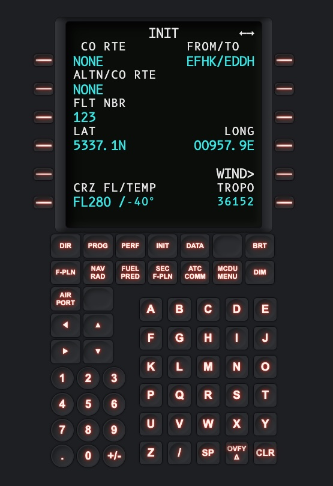
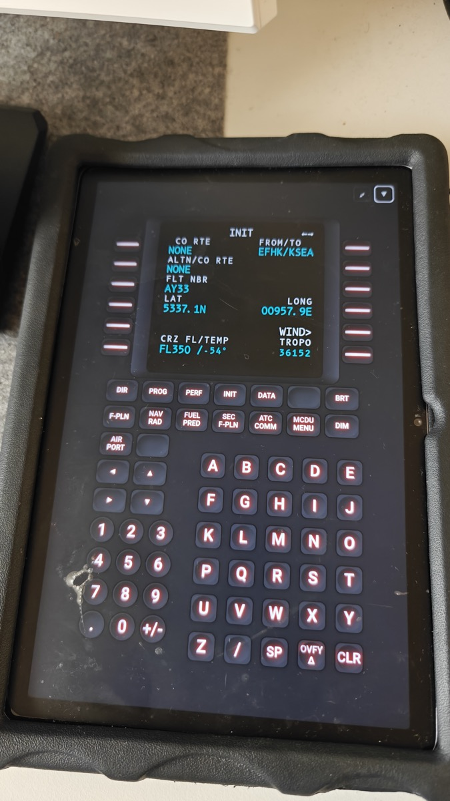
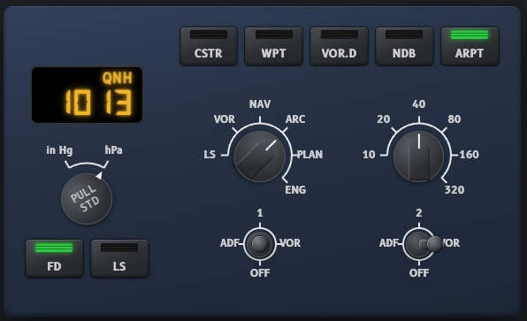
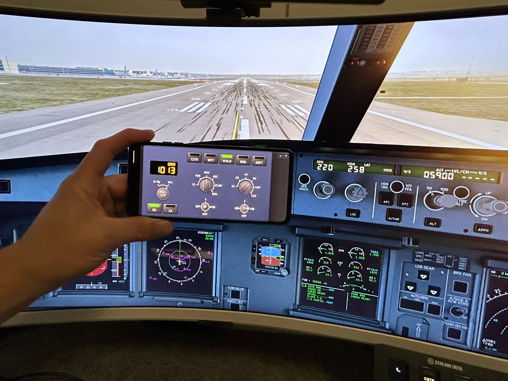

# X-Plane A330 Panels

Web-based cockpit panels for X-Plane 12's stock Airbus A330 — an **MCDU
(CDU)** and an **EFIS control panel**, both in one page, switched with a
Panel selector in the top bar. Runs in any browser, no X-Plane plugin to
install. Open it on a tablet on the same network as the sim and you have
extra hardware next to your keyboard.

## Screenshots

<table>
<tr>
<td align="center" width="50%"><br>MCDU — Desktop</td>
<td align="center" width="50%"><br>MCDU — Tablet</td>
</tr>
<tr>
<td align="center" width="50%"><br>EFIS — Desktop</td>
<td align="center" width="50%"><br>EFIS — Phone</td>
</tr>
</table>

Both panels live on the same page, switched with the **Panel** selector.

## Requirements

- X-Plane 12.1.4 or later, with the Web API on and **Allow incoming
  connections** on (**Settings → Network**).
- Node.js 22.4+ — unless you grab the single-file executable release,
  which needs nothing installed at all.
- A tablet (or any other device) on the same network, if you want to use
  this away from the X-Plane machine.

**Scope:** verified against the default/stock A330 only. Add-on airliners
need their own profile — see [`ARCHITECTURE.md`](ARCHITECTURE.md).

## Getting started

[**Download the latest release**](https://github.com/larsten42/xplane-a333-panels/releases/latest/download/xplane-a333-panels.zip)
and unzip it, or clone the repo:

```sh
git clone https://github.com/larsten42/xplane-a333-panels.git
cd xplane-a333-panels
```

Either way, then:

```sh
node tools/mcdu-server.js
```

Don't want to install Node? The [releases page](https://github.com/larsten42/xplane-a333-panels/releases/latest)
also has a single-file executable for Windows/macOS/Linux with everything
built in. Browsers don't preserve the executable bit on what they
download, so there's a one-time step first — from Terminal, in whatever
folder it downloaded to:

- **macOS**: `chmod +x mcdu-server-darwin-arm64 && xattr -d com.apple.quarantine mcdu-server-darwin-arm64`
  — the second command clears Gatekeeper's "downloaded from the internet"
  quarantine flag, which blocks it from running even though the binary is
  already (ad-hoc) signed.
- **Linux**: `chmod +x mcdu-server-linux-x64`
- **Windows**: no extra step, but SmartScreen will flag the `.exe` as from
  an unrecognized publisher the first time — click **More info → Run
  anyway**.

Then run it directly, no `node` command needed.

Open the printed URL — `http://localhost:5173` on the X-Plane machine, or
`http://<that machine's LAN IP>:5173` from a tablet — and press **Connect**.
There's no host or port to configure; the page always talks back to
whatever server it loaded from. Use the **Panel** selector in the top bar to
switch between MCDU and EFIS — both share the one connection, so there's no
need to reconnect when switching.

## More information

[`ARCHITECTURE.md`](ARCHITECTURE.md) covers how it works under the hood,
building from source (including the single-executable build), the mock
server for offline development, known limitations, interface details for
each panel, adding support for another aircraft, the bundled fonts, project
layout, and the roadmap.

For the X-Plane Web API protocol itself — endpoints, message formats, the
CDU dataref layout, and rough edges found along the way — see
[`docs/xplane-web-api-notes.md`](docs/xplane-web-api-notes.md).

## License

MIT — see [`LICENSE`](LICENSE). The bundled fonts (`fonts/`) are under the
separate SIL Open Font License; see [`fonts/OFL.txt`](fonts/OFL.txt) (B612
family) and [`fonts/DSEG-OFL.txt`](fonts/DSEG-OFL.txt) (DSEG7 Modern).
