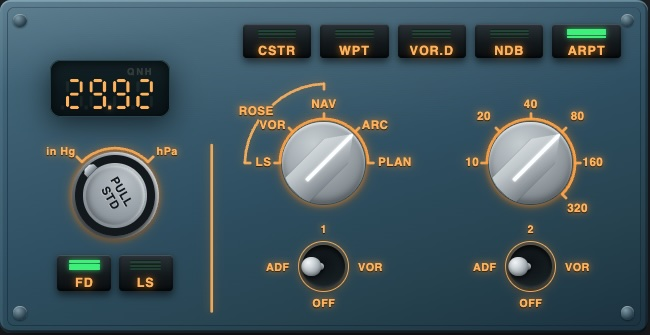
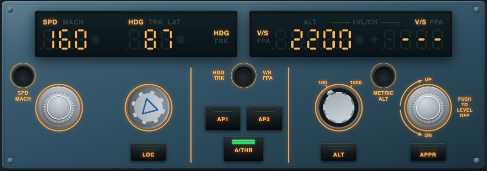

# X-Plane A330 Panels

Web-based cockpit panels for X-Plane 12's stock aircraft — a full **MCDU**,
**EFIS**, and **FCU** set for the Airbus A330, plus **MCDU**-only support
for the Boeing 737-800 — all in one page, switched with a **Panel**
selector (and an **Aircraft** selector for which airframe's MCDU to use).
Runs in any browser, no X-Plane plugin to install.

## Quick start

1. **Download** the [latest release](https://github.com/larsten42/xplane-a333-panels/releases/latest) — the zip (needs Node.js) or the single-file executable for your OS (needs nothing installed at all).
2. **Run it.** A browser tab opens automatically on the X-Plane machine with everything you need: connection status and a QR code for each address it's reachable at.
3. **Scan the QR code** with your tablet, hit **Connect**, and you're flying.

No plugin, no account, no config file to hand-edit. Prefer a proper
home-screen icon on the tablet over a browser tab? Chrome's **⋮ menu →
Add to Home screen** adds one in a tap — see [Extras](#extras).

## Screenshots

<table>
<tr>
<td align="center" width="50%"><br>MCDU — Desktop</td>
<td align="center" width="50%"><br>MCDU — Tablet</td>
</tr>
<tr>
<td align="center" width="50%"><br>EFIS</td>
<td align="center" width="50%"><br>FCU</td>
</tr>
</table>

## Status & scope

- **MCDU** — Airbus A330 or Boeing 737-800, picked with the **Aircraft**
  selector. Both are the default/stock aircraft only; add-on airliners
  (Zibo, FlightFactor, ToLiss, ...) replace the default FMS entirely and
  aren't supported.
- **EFIS** and **FCU** — Airbus A330 only. Boeing's real hardware is
  different enough (an MCP instead of an FCU, a different EFIS control
  panel) that supporting the 737 here means a new panel design, not a
  config change — not done, and not close.
- **FCU** is the newest of the three panels: every button, knob, and
  display is wired to a real command/dataref and usable, but it's had
  less real-flight mileage than MCDU/EFIS, and a couple of annunciators
  (LVLCH) have no confirmed driving dataref yet.

See [`ARCHITECTURE.md`](ARCHITECTURE.md) for the full known-limitations
list and the roadmap.

## Requirements

- X-Plane 12.1.4 or later, with the Web API on and **Allow incoming
  connections** on (**Settings → Network**).
- Node.js 22.4+ — unless you grab the single-file executable release,
  which needs nothing installed at all.
- A tablet (or any other device) on the same network, if you want to use
  this away from the X-Plane machine.

## Getting started

[**Download the latest release**](https://github.com/larsten42/xplane-a333-panels/releases/latest/download/xplane-a333-panels.zip)
and unzip it, or clone the repo:

```sh
git clone https://github.com/larsten42/xplane-a333-panels.git
cd xplane-a333-panels
```

Either way, then:

```sh
node tools/mcdu-server.js
```

Don't want to install Node? The [releases page](https://github.com/larsten42/xplane-a333-panels/releases/latest)
also has a single-file executable for Windows/macOS/Linux with everything
built in. Browsers don't preserve the executable bit on what they
download, so there's a one-time step first — from Terminal, in whatever
folder it downloaded to:

- **macOS**: `chmod +x mcdu-server-darwin-arm64 && xattr -d com.apple.quarantine mcdu-server-darwin-arm64`
  — the second command clears Gatekeeper's "downloaded from the internet"
  quarantine flag, which blocks it from running even though the binary is
  already (ad-hoc) signed.
- **Linux**: `chmod +x mcdu-server-linux-x64`
- **Windows**: no extra step, but SmartScreen will flag the `.exe` as from
  an unrecognized publisher the first time — click **More info → Run
  anyway**.

Then run it directly, no `node` command needed.

Starting the server opens an **operator console** in a browser tab on the
host machine, and prints the same URL to the terminal. Open the address
it shows — `http://localhost:5173` on the X-Plane machine, or
`http://<that machine's LAN IP>:5173` from a tablet — and press
**Connect**. There's no host or port to configure; the page always talks
back to whatever server it loaded from. Use the **Panel** selector in the
top bar to switch between MCDU, EFIS, and FCU — all three share the one
connection, so there's no need to reconnect when switching.

## Extras

- **Operator console** (`/console`, opened automatically on server
  start): server and X-Plane connection status, a QR code per network
  interface for pointing a tablet at the right address without typing it
  in, and who's currently connected.
- **Android home-screen shortcut**: Chrome's **⋮ menu → Add to Home
  screen** adds one with the app's own icon and name. It opens as a
  normal browser tab rather than a standalone app — that needs HTTPS,
  which a LAN-only server like this doesn't have (see
  [`ARCHITECTURE.md`](ARCHITECTURE.md) for why that's a deliberate
  tradeoff, not an oversight).

## More information

[`ARCHITECTURE.md`](ARCHITECTURE.md) covers how it works under the hood,
building from source (including the single-executable build), the mock
server for offline development, known limitations, interface details for
each panel, adding support for another aircraft, the bundled font, project
layout, and the roadmap.

For the X-Plane Web API protocol itself — endpoints, message formats, the
CDU dataref layout, and rough edges found along the way — see
[`docs/xplane-web-api-notes.md`](docs/xplane-web-api-notes.md).

## License

MIT — see [`LICENSE`](LICENSE). The bundled font (`fonts/B612Mono-Regular.ttf`)
is under the separate SIL Open Font License; see
[`fonts/OFL.txt`](fonts/OFL.txt).
